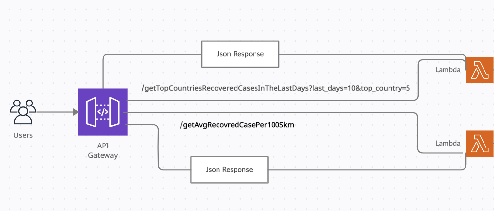

# AWS Lambda example

## infrastructure:

## How to use:

### getAvgRecovredCasePer100Skm
- The average recovered cases per 100 square KM per country since the pandemic began.
 https://383k1uteq3.execute-api.us-east-2.amazonaws.com/dev/getAvgRecovredCasePer100Skm

### getTopCountriesRecoveredCasesInTheLastDays
-  example: The top (5 =>top_country) countries with most recovered per capita, in the last (10=>last_days) days.

- need two params: last_days and top_country
 https://383k1uteq3.execute-api.us-east-2.amazonaws.com/dev/getTopCountriesRecoveredCasesInTheLastDays?last_days=7&top_country=10

## Reference:
https://github.com/M-Media-Group/Covid-19-API

### NOTE:
 https://383k1uteq3.execute-api.us-east-2.amazonaws.com/dev/getTop5Countries
